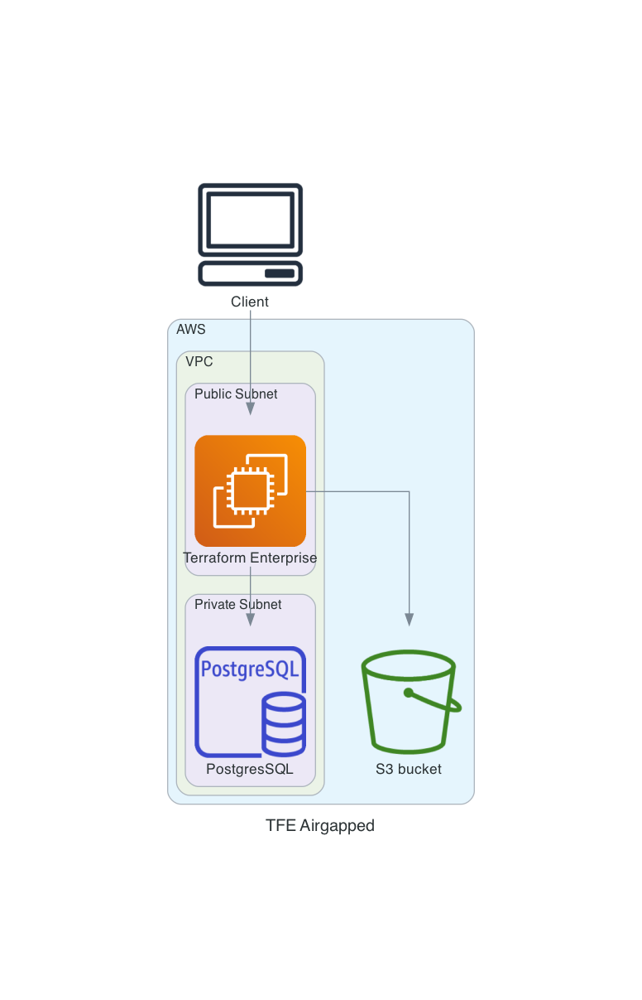

# Terraform Enterprise Airgapped installation with valid certificates on AWS  
This repository installs an Airgapped Terraform Enterprise (TFE) with valid certificates in AWS on a Ubuntu virtual machine.  

This terraform code creates
- A VPC
- Subnets
- Internet gateway
- Route Table entry
- Key pair
- Security group
- Security group rules
- S3 Buckets
- PostgreSQL Database
- An Elastic IP
- A Route53 DNS entry
- Valid certificates
- An Ubuntu virtual machine (22.04)
  - Replicated configuration
  - TFE settings json
  - Install TFE airgapped
  - TFE Admin account

# Diagram


# Prerequisites
 - An AWS account with default VPC and internet access.
 - A TFE Airgap installation file
 - A TFE license

# How to install airgapped TFE with valid certficates on AWS
- Clone this repository.  
```
git clone https://github.com/paulboekschoten/tfe_external_services_airgapped.git
```

- Go to the directory 
```
cd tfe_demo_selfsigned_certificate_aws
```
- Save your TFE license in `config/license.rli`.  

- Save your airgap file in `files/`.  

- Rename `terraform.tfvars_example` to `terraform.tfvars`.  
```
mv terraform.tfvars_example terraform.tfvars
```

- Change the values in `terraform.tfvars` to your needs.

- Set your AWS credentials
```
export AWS_ACCESS_KEY_ID=
export AWS_SECRET_ACCESS_KEY=
export AWS_SESSION_TOKEN=
```

- Terraform initialize
```
terraform init
```
- Terraform plan
```
terraform plan
```

- Terraform apply
```
terraform apply
```

Terraform output should show 37 resources to be created with output similar to below. 
```
Apply complete! Resources: 37 added, 0 changed, 0 destroyed.

Outputs:

public_ip = "15.236.36.65"
replicated_dashboard = "https://tfe-airgap-paul.tf-support.hashicorpdemo.com:8800"
ssh_login = "ssh -i tfesshkey.pem ubuntu@tfe-airgap-paul.tf-support.hashicorpdemo.com"
tfe_login = "https://tfe-airgap-paul.tf-support.hashicorpdemo.com"
```

- Go to the Replicated dashboard. (Can take 10 minutes to become available.)  
- Click on the open button to go to TFE of go to the `tfe_login` url.  

# TODO

# DONE
- [x] Create manually
- [x] Add diagram
- [x] Create VPC
- [x] Create Subnets
- [x] Create Internet gateway
- [x] Change default Route Table
- [x] Create Key pair
- [x] Create security groups
- [x] Create a security group rules
- [x] Create an EC2 instance
- [x] Create EIP
- [x] Create DNS record
- [x] Create valid certificate
- [x] Create S3 bucket
- [x] Create PostgreSQL database
- [x] Install TFE 
  - [x] Create settings.json
  - [x] Create replicated.conf
  - [x] Copy certificates
  - [x] Copy airgap file
  - [x] Copy license.rli
  - [x] Create admin user
- [x] Documentation