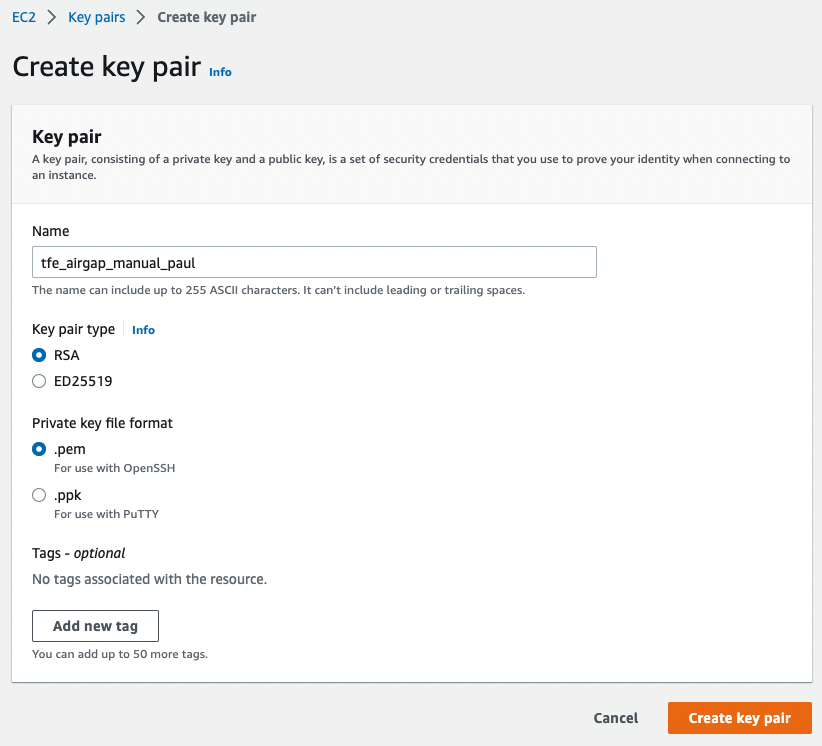
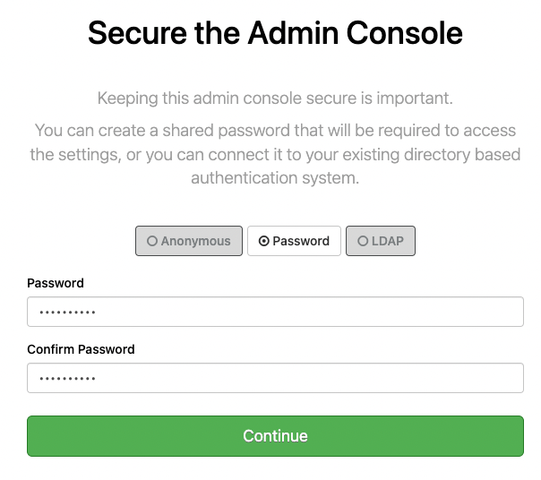
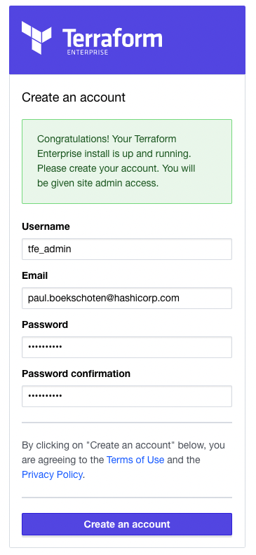

# Manual installation of TFE (Airgapped), external services, valid certificate on AWS

Here it is described how to manually install Airgapped Terraform Enterpise (TFE) with external services (PostgreSql and S3) and a valid certificate on AWS.  

Official installation documentation can be found [here](https://www.terraform.io/enterprise/install/interactive/installer).  

# Prerequisites
- AWS account
- Airgapped installation file
- TFE license


# How to

## VPC
Go to `VPC` and click `Create VPC`.  
  
Give it a name and an IPv4 CIDR range.  

## Subnets
Go to `Subnets`.  

### Public
For TFE  
Click on `Create subnet`.  
  
Select your VPC.  

    
Supply a name and an IPv4 CIDR block within the range of the VPC CIDR.  

Click `Create subnet`.  

### Private
For PostgreSQL  
Click on `Create subnet`.  
  
Select your VPC.  

      
Supply a name and an IPv4 CIDR block within the range of the VPC CIDR and not overlapping with other subnets.    

Click `Create subnet`. 

## Internet Gateway
Go to `Internet gateways`.  
Click `Create Internet gateway`.  
  
Provide a name and click `Create internet gateway`.  

Click on `Actions` and then on `Attach to VPC`.  
  
Select the VPC and click on `Attach internet gateway`.  

## Route table
Go to `Route tables` and select the new route table.  
  

Click on `Edit routes`.  
  
Add a route with destination `0.0.0.0/0` and target the created internet gateway.  

Click `Save changes`.  

## Key pair
To be able to login with ssh to your ec2 instance, you'll need a key pair.  
Go to `Key pairs` and click `Create key pair`.  
    

Give it a useful name and click `Create key pair`.  

A pem file will be downloaded in the browser.  
Store this pem file in a secure location and change the permissions to only your user.  
On linux/mac:
```
chmod 0600 tfe_valid_cert_paul.pem
```

## Security group
Allow certain ports to connect to your TFE instance.  
Go to Security Groups and click Create security groups.  
  
Supply a name, description and select the VPC.  

  
Port 22, 443 and 8080 are accessible from anywhere.  
Port 5432 is accessible from anywhere within the VPC.  

    
To simulate the no internet connectivity, use `My IP` instead of `0.0.0.0/0` under `Source`.  

Click `Create security group`.  


## EC2 instance
Create an EC2 instance to install TFE on.  
Go to EC2 instances and click `Launch instances`.  
   
Provide a name.  

    
Select `Ubuntu`.  

    
Pick `m5.xlarge`  

  
Select the key pair created in the previous step.  

    
Under `Network Settings`, click on `Edit`.  
Select the VPC.  
Select the public subnet.  
Select the existing security group created in the previous step. 

    
Set the size of the disk to 100GB.  

Click `Launch instance'.  


## EIP
Go to `Elastic IPs` and click `Allocate Elastic IP address`.  
  
Click `Allocate`  

  
Select the newly created IP, click on `Actions` and then on `Associate Elastic IP address`.  

    
Select your instance.  

Click on `Associate`. 

# SSH login
You can login with the pem file and the public elastic ip.  
```
ssh -i tfe_airgap_manual_paul.pem ubuntu@15.236.118.150
```

## Create DNS record
Go to Route 53, Hosted Zones, tf-support.hashicorpdemo.com  
Click `Create record`.  
    
- Enter a `Record name`, this will be the subdomain of the hosted zone.  
- Under `Value` enter the elastic ip address.  

## Certificate from Let's Encrypt
On a UNIX machine with certbot installed enter the following command  
```
sudo certbot -d tfe-airgap-manual-paul.tf-support.hashicorpdemo.com --manual --preferred-challenges dns certonly --register-unsafely-without-email
```

Create a DNS record as described  
    
Click `Create records`.  

Click on `View status` and make sure it is `insync`.  

Hit `Enter` on the commandline.  

```
Successfully received certificate.
Certificate is saved at: /etc/letsencrypt/live/tfe-airgap-manual-paul.tf-support.hashicorpdemo.com/fullchain.pem
Key is saved at:         /etc/letsencrypt/live/tfe-airgap-manual-paul.tf-support.hashicorpdemo.com/privkey.pem
This certificate expires on 2023-02-20.
...
```
Delete the created DNS TXT record.  

From the stored Let's Encrypt files, retrieve the `fullchain.pem` and `privkey.pem`.   
```
sudo cp /etc/letsencrypt/live/tfe-airgap-manual-paul.tf-support.hashicorpdemo.com/fullchain.pem ./
sudo cp /etc/letsencrypt/live/tfe-airgap-manual-paul.tf-support.hashicorpdemo.com/privkey.pem ./
sudo chown paulboekschoten:staff fullchain.pem privkey.pem
```

## S3 bucket
https://developer.hashicorp.com/terraform/enterprise/requirements/data-storage/operational-mode-requirements

Go to `Buckets`.  
Click `Create bucket`.  

    
Enter a name and leave all defaults.  
  
  
  

Click `Create bucket`.  

Allow instance to connect to S3 via IAM role.  
https://aws.amazon.com/premiumsupport/knowledge-center/ec2-instance-access-s3-bucket/

Go to `Identity and Access Management (IAM)` and then `Roles`.  
Click `Create role`.  

  
Select `AWS service` as trusted entity type.  
Under Use cases, select `EC2` (common use cases).  
Click `Next: Permissions`.  

Click `Create policy`.  

  
Under Service select `S3`.  

  
Under Actions, select `All S3 actions (s3:*)`.  

  
Under resources, click `Add ARN` in the `bucket` section.  

    
Enter the bucket name and click `Add`.  

Click `Next: Tags`.  
Click `Next: Review`.  

  
Provide a name and a description.  
Click `Create policy`.  

Close this tab and go back to the tab for Roles.  

Click the refresh button.  

  
Select the newly created policy and click `Next`.  

  
Provide a name for the role.  

  
Click `Create role`.  

Go to the EC2 instances.  

  
Select the tfe instance.  
Click on `Actions`.  
Click on `Security`.  
Click on `Modify IAM role`.  

  
Select your IAM role, click `Update IAM role`.  


## PostgreSQL
https://developer.hashicorp.com/terraform/enterprise/requirements/data-storage/postgres-requirements

Go to `RDS`.  
Click `Create database`.  

  
Select `Standard create`.  

  
Select `PostgreSQL`.  
Select the version wanted. Here 14.5-R1.  

  
Select the `Dev/test` template.  

  
Select `Single DB instance`.  

  
Provide a name for the database.  
Enter a password for the `Master` account.  

  
Select the `db.m5.large` instance.  

  
Select `General Purpose SSD (gp2)`.  
Set the `Allocated storage` to 50 GiB.  

  
Select `Connect to an EC2 compute resource`.  
Select the EC2 instance.  
  
Select the security group.  

  

  

  
Expand `Additional configuration`.  
Provide an initial database name.  If none provided, no database will be created.  

  

Click `Create database`.  

## Docker
Requirements: https://developer.hashicorp.com/terraform/enterprise/requirements/docker  

Install manual: https://docs.docker.com/engine/install/ubuntu/#install-from-a-package  

Go to: https://download.docker.com/linux/ubuntu/dists/jammy/pool/stable/amd64/  
Download and place in the folder `files`:
  - containerd.io_1.6.9-1_amd64.deb
  - docker-ce_20.10.21~3-0~ubuntu-jammy_amd64.deb 
  - docker-ce-cli_20.10.21~3-0~ubuntu-jammy_amd64.deb 
  - docker-compose-plugin_2.6.0~ubuntu-jammy_amd64.deb 

Copy these files to your TFE host.  
```
scp -i tfe_airgap_manual_paul.pem files/*.deb ubuntu@15.236.118.150:/tmp
```

Login with ssh to the EC2 instance.  
```
ssh -i tfe_airgap_manual_paul.pem ubuntu@15.236.118.150
```

Install Docker  
```
cd /tmp
sudo dpkg -i ./containerd.io_1.6.9-1_amd64.deb \
  ./docker-ce_20.10.21_3-0_ubuntu-jammy_amd64.deb \
  ./docker-ce-cli_20.10.21_3-0_ubuntu-jammy_amd64.deb \
  ./docker-compose-plugin_2.6.0_ubuntu-jammy_amd64.deb
```


## TFE
Download the `Installer bootstrapper`.  
https://install.terraform.io/airgap/latest.tar.gz  

Copy installer to the TFE instance.  
```
scp -i tfe_airgap_manual_paul.pem files/replicated.tar.gz ubuntu@15.236.118.150:/tmp
```

Copy your TFE airgap file to the TFE instance.  
```
scp -i tfe_airgap_manual_paul.pem files/tfe_660.airgap ubuntu@15.236.118.150:/tmp
```

Login with SSH to the TFE instance.  
Login with ssh to the EC2 instance.  
```
ssh -i tfe_airgap_manual_paul.pem ubuntu@15.236.118.150
```

Extract the installer
```
cd /tmp
tar xzf replicated.tar.gz
```

Run the installer
```
sudo ./install.sh airgap
```

```
Determining local address
The installer was unable to automatically detect the private IP address of this machine.
Please choose one of the following network interfaces:
[0] ens5 	10.100.0.198
[1] docker0	172.17.0.1
Enter desired number (0-1): 0
```
Select 0.  

```
Operator installation successful

To continue the installation, visit the following URL in your browser:

  http://<this_server_address>:8800
```

In a browser, go to http://tfe-airgap-manual-paul.tf-support.hashicorpdemo.com:8800

  
Click `Continue to Setup`.  

  
Enter the hostname.  
Select the private key and certificate in the corresponding boxes.  
Click `Upload & Continue`.  

  
Upload your TFE license.  

  
Select `Airgapped` and click `Continue`.  

  
Provide the path to the airgap bundle on the server.  
Click `Continue`.  

Page kept loading, had to refresh to continue.  

  
Provide a password and click `Continue`.  

  
Click `Continue`.  

On the `Settings` page
  
Provide an encryption password.  

  
Select `External Services` for production type.  

  
Provide the required fields.  
Hostname can be found in the AWS console.  

  
Select `Use instance profile for access`.  
Provide the bucket name.  
Provide the region.  
(Edit the outbound rule for the security group from `My IP` to `Anywhere-IPv4` and save.)

Click `Save`.  

Click `Restart`.  

  
Click on `Open`.  

  
Provide an admin username, email and password.  
Click `Create an account`.  
